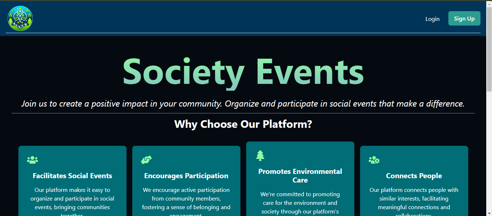
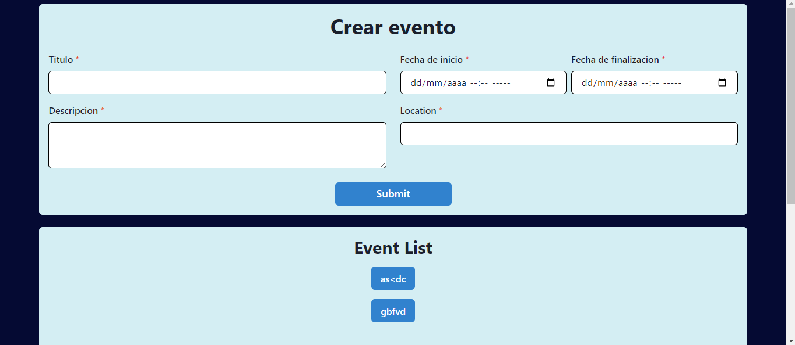
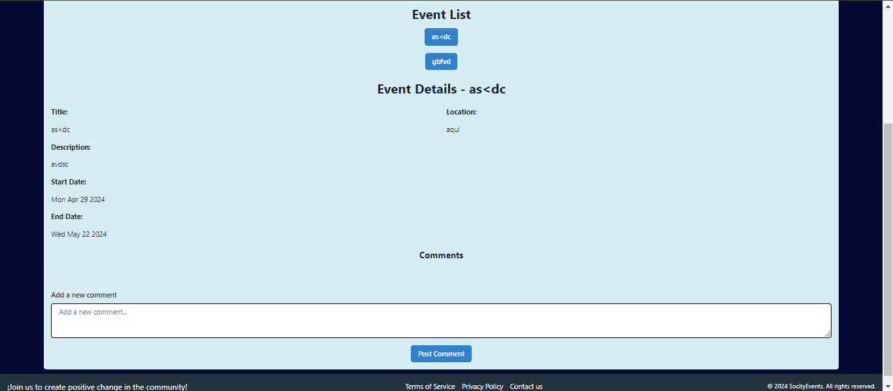
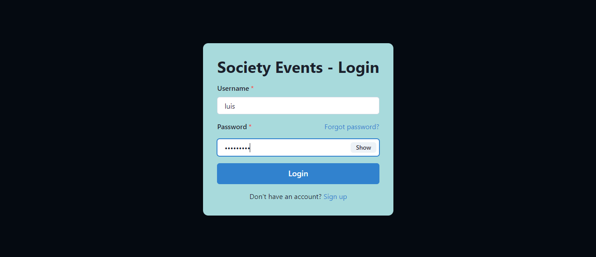

# Society Events

This project is a platform for managing and organizing events. It provides functionalities for creating events, registering, commenting, and more.

## Screenshots

### Home View

### Create Event View

### Event Details View

### Login View

### Signup View

## Frontend

### Installation and Usage

1. Clone this repository on your local machine.
2. Navigate to the project directory in your terminal.
3. Install the dependencies with `npm install` or `yarn install`.
4. Start the application with `npm start` or `yarn start`.

### Project Structure

- `src/`: Contains all the frontend source code.
  - `components/`: Reusable components used in the application.
  - `pages/`: Top-level components for different pages.
  - `App.jsx`: Main component setting up routes and theme for the app.
  - Other files like `index.js`, `App.css`, etc.

### Technologies Used

- React: JavaScript library for building user interfaces.
- Chakra UI: Component library for React applications.
- Axios: HTTP client for making requests to the API.

## Backend

The backend for this application is in a separate repository at the following URL: [Link to Backend Repository](link_to_backend_repo).

### Technologies Used

- Django: Web development framework in Python.
- Django REST Framework: Library for building RESTful APIs in Django.
- PostgreSQL: Relational database for storing data.

## Contribution

### Planned Features

We have an exciting roadmap ahead with planned features to enhance the functionality and user experience of our application. Here are some of the features we plan to implement in the future:

1. **Edit Events**: Introduce the ability for users to edit events they have created, allowing for modifications such as updating event details or changing event dates.

2. **History of Own Events**: Implement a feature that provides users with a history or log of events they have created or participated in, enhancing event management and tracking capabilities.

3. **Event Filters**: Enhance the event browsing experience by adding filters based on categories, dates, locations, and other relevant criteria, making it easier for users to find events of interest.

4. **Event Calendar**: Integrate a calendar view within the application that displays upcoming events, allows users to schedule new events, and provides a visual representation of event timelines.

We welcome contributions from the community to help us realize these features and improve the overall functionality of our application. If you're interested in contributing, please refer to our [Contribution Guidelines](CONTRIBUTING.md) for detailed instructions.

## License

This project is licensed under the MIT License. See the `LICENSE` file for more details.

